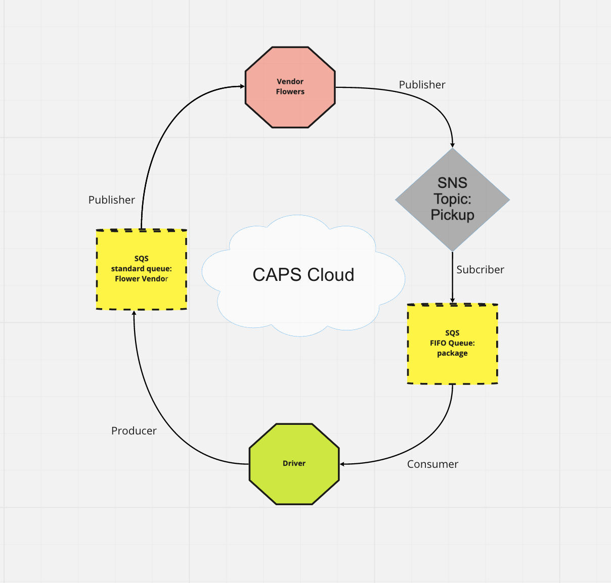
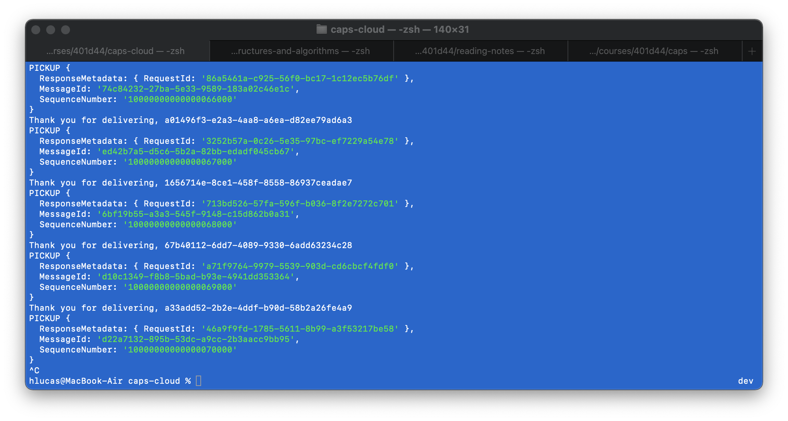
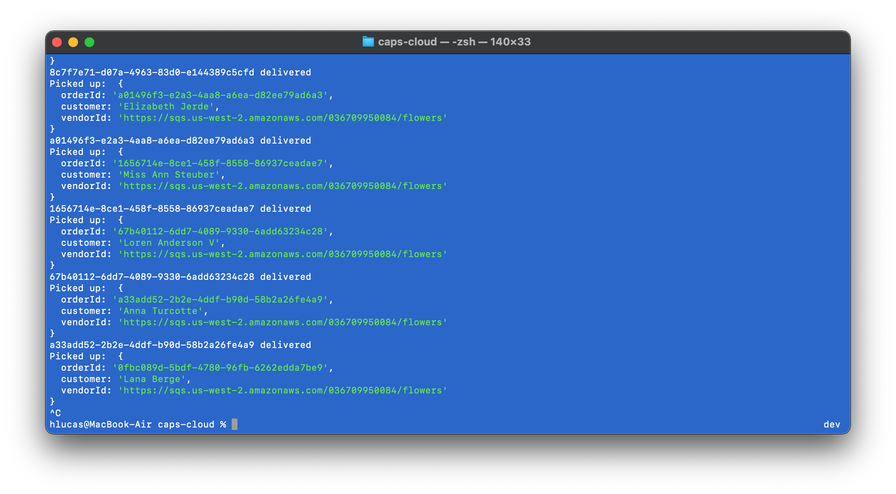

# caps-cloud

Created by Harvey Lucas and Roop Hayer

## Usage

Use of this project requires two terminals. After following the Installation instructions below, open two terminals in the project root directory. The following commands should be run, one per terminal, in the order listed. Pickups are generated at five second intervals.

1. In terminal 1, run `node driver.js`
2. In terminal 2, run `node vendor.js`

## Installation

```plaintext
> npm install aws-sdk sqs-consumer sqs-producer faker
```

## Summary of Problem Domain

### Lab: Class 19

AWS: Events - Code Academy Parcel Service (CAPS)

Create a real-time service that allows for vendors, such as flower shops or restaurants, to alert a system of a package needing to be delivered, for drivers to instantly see what’s in their pickup queue, and then to alert the vendors when the package is delivered.

### Required Services

1. SNS Topic: pickup which will receive all pickup requests from vendors
2. SQS Queue (FIFO): packages which will contain all delivery requests from vendors, in order of receipt.
   Subscribe this queue to the pickup topic so all pickups are ordered
3. SQS Queue (Standard) for each vendor (named for the vendor) which will contain all delivery notifications from the drivers

## Visual Overview



### Vendor



### Driver


